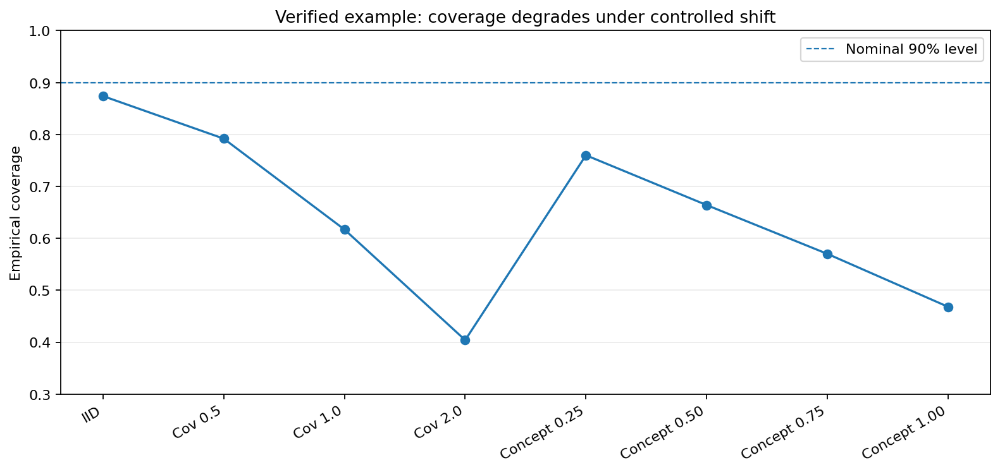

# ConformalGuard

**Stress-test conformal prediction before distribution shift breaks your coverage.**

ConformalGuard is a CPU-friendly Python toolkit for measuring how conformal classification behaves when deployment data no longer matches calibration data. It runs reproducible IID, covariate-shift, label-shift, and concept-shift experiments and produces coverage, accuracy, set-size, empty-set, degradation, CSV/JSON, and plot reports.

> Conformal prediction can provide finite-sample coverage under appropriate assumptions. ConformalGuard measures what happens when controlled deployment shifts violate those assumptions; it does not claim guarantees under arbitrary shift.



## Install

Once published to PyPI:

```bash
pip install conformalguard
```

From source:

```bash
git clone https://github.com/chinmaygit-lab/ConformalGuard.git
cd ConformalGuard
python -m pip install -e ".[dev]"
```

## 30-second quickstart

Run the built-in reproducible demo:

```bash
conformalguard demo --out artifacts/demo
```

Run the same stress test on a numeric CSV dataset:

```bash
conformalguard benchmark data.csv --target label --out artifacts/my_run
```

Or use the Python API:

```python
from sklearn.datasets import load_breast_cancer
from conformalguard import ConformalGuard

X, y = load_breast_cancer(as_frame=True, return_X_y=True)

guard = ConformalGuard()
guard.run(X, y)

print(guard.summary())
print(guard.degradation())
guard.save_report("artifacts")
```

The high-level interface automatically runs IID plus controlled covariate, label, and concept shift grids across multiple random seeds. `save_report()` also creates a static `report.html` with summary cards, tables, and plots. Advanced users can still import the lower-level experiment functions directly.

## What gets generated

A standard run writes:

```text
artifacts/
├── robustness_summary.csv
├── robustness_summary.json
├── robustness_degradation.csv
├── robustness_degradation.json
├── report.html
├── robustness_accuracy.png
├── robustness_coverage.png
├── robustness_accuracy_degradation.png
└── robustness_coverage_degradation.png
```

## Why ConformalGuard?

A conformal predictor can look well calibrated on IID data and degrade substantially after deployment shift. ConformalGuard makes that failure mode measurable instead of hiding it behind one aggregate accuracy number.

The benchmark tracks:

- empirical coverage and coverage gap
- accuracy and macro F1
- mean prediction-set size
- empty-set rate
- IID-relative degradation
- mean and standard deviation across seeds

## Supported shift families

| Shift | What changes | What it probes |
|---|---|---|
| IID | Nothing | Reference condition |
| Covariate | Feature distribution | Sensitivity to input drift |
| Label | Class prevalence | Sensitivity to population mix |
| Concept | Relationship between features and labels | Sensitivity to conditional drift |

## Verified example result

One verified run on scikit-learn's breast-cancer dataset produced the following values:

| Condition | Mean accuracy | Mean coverage |
|---|---:|---:|
| IID | 0.980 | 0.874 |
| Covariate severity 0.5 | 0.889 | 0.792 |
| Covariate severity 1.0 | 0.716 | 0.617 |
| Covariate severity 2.0 | 0.468 | 0.404 |
| Concept severity 0.25 | 0.854 | 0.760 |
| Concept severity 0.50 | 0.743 | 0.664 |
| Concept severity 0.75 | 0.620 | 0.570 |
| Concept severity 1.00 | 0.509 | 0.468 |

These are one reproducible example run, not universal performance claims. Results depend on the dataset, split, classifier, random seeds, conformity score, confidence level, and shift configuration.

## Advanced configuration

```python
from conformalguard import ConformalGuard, GuardConfig

config = GuardConfig(
    confidence_level=0.90,
    conformity_score="lac",
    seeds=(11, 42, 73),
    covariate_severities=(0.0, 0.5, 1.0, 2.0),
    concept_severities=(0.0, 0.25, 0.50, 0.75, 1.0),
    feature_fraction=0.50,
)

guard = ConformalGuard(config)
guard.run(X, y)
```

CLI grids use comma-separated values:

```bash
conformalguard demo \
  --confidence 0.90 \
  --seeds 11,42,73 \
  --covariate-severities 0,0.5,1,2 \
  --concept-severities 0,0.25,0.5,0.75,1
```

## Reproducibility and scope

ConformalGuard records or controls train/calibration/test splitting, random seeds, confidence level, conformity score, shift severity, feature fraction, label target proportions, concept-shift feature, classification metrics, and conformal metrics.

The current benchmark focuses on controlled, synthetic shifts for tabular classification. Those mechanisms isolate failure modes but do not reproduce every production environment. Natural temporal drift, online adaptation, recalibration policies, recovery-cost experiments, and broader multi-dataset evaluation remain important extensions.

## Development

```bash
python -m pip install -e ".[dev]"
python -m ruff check src tests examples
python -m pytest -q
python -m build
python -m twine check dist/*
```

The public repository's latest documented checkpoint before this productization patch reports **116 passing tests** for the experimental core.

## Citation

Citation metadata is provided in `CITATION.cff`.

## License

Apache-2.0. Review the license choice before publishing the first package release.
